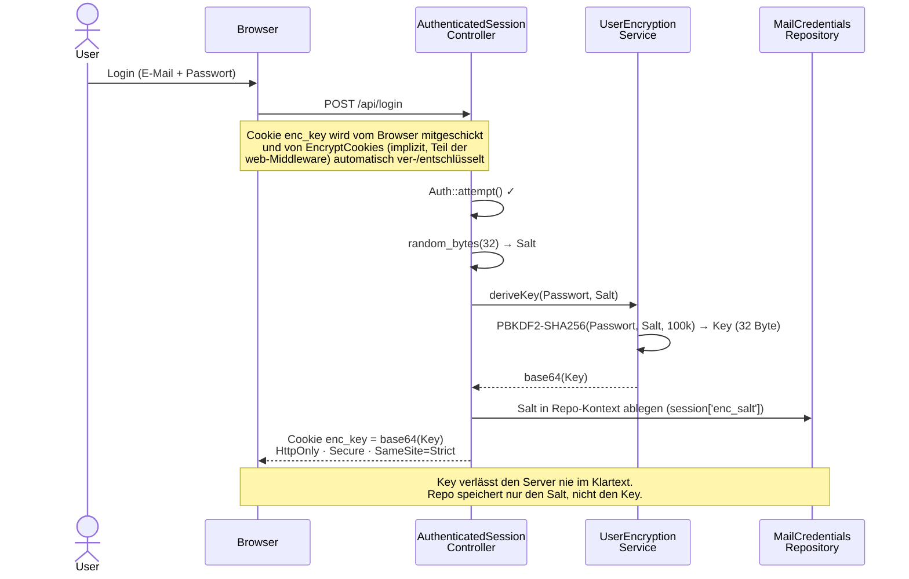
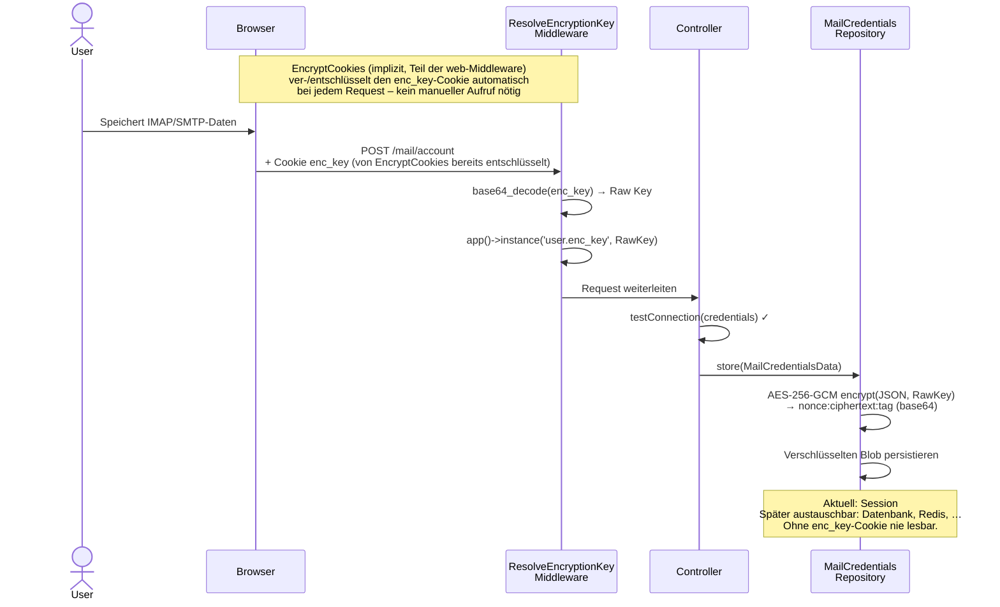
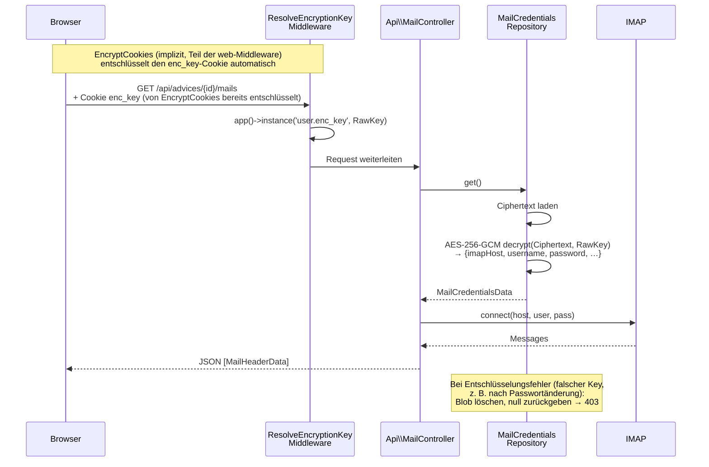
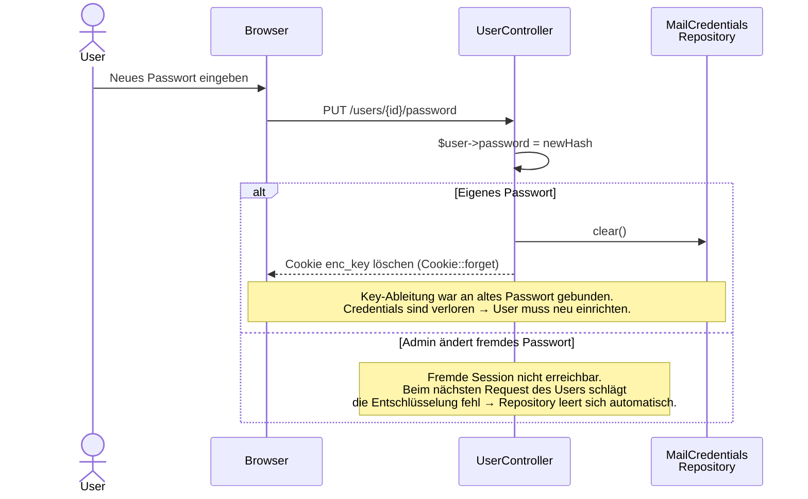

# Mail-Verschlüsselung – Sequenzdiagramm

Zero-Knowledge-Ansatz: Der Server speichert niemals den Klartext-Key. Admin mit Datenbankzugriff kann Mail-Credentials nicht entschlüsseln.

## Login & Key-Ableitung



## Mail-Credentials speichern



## Mail abrufen (Folge-Request)



## Passwort ändern



## Doppelte Verschlüsselung auf einen Blick

```
Browser-Cookie:   base64(Key)  ←→  APP_KEY-Verschlüsselung durch EncryptCookies
                                    (implizit, Teil der web-Middleware – kein manueller Aufruf)
                                    (Layer 1: Schutz des Keys im Transit)

Repository:       nonce:ciphertext:tag
                  ←→  AES-256-GCM mit PBKDF2(Passwort)-Key
                                    (Layer 2: Zero-Knowledge, Admin kann nicht lesen)
```
